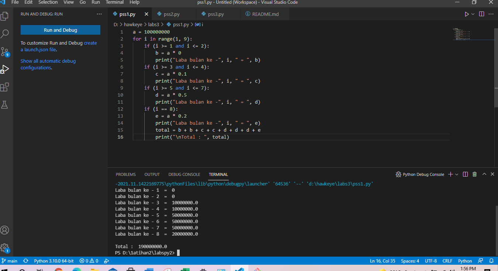
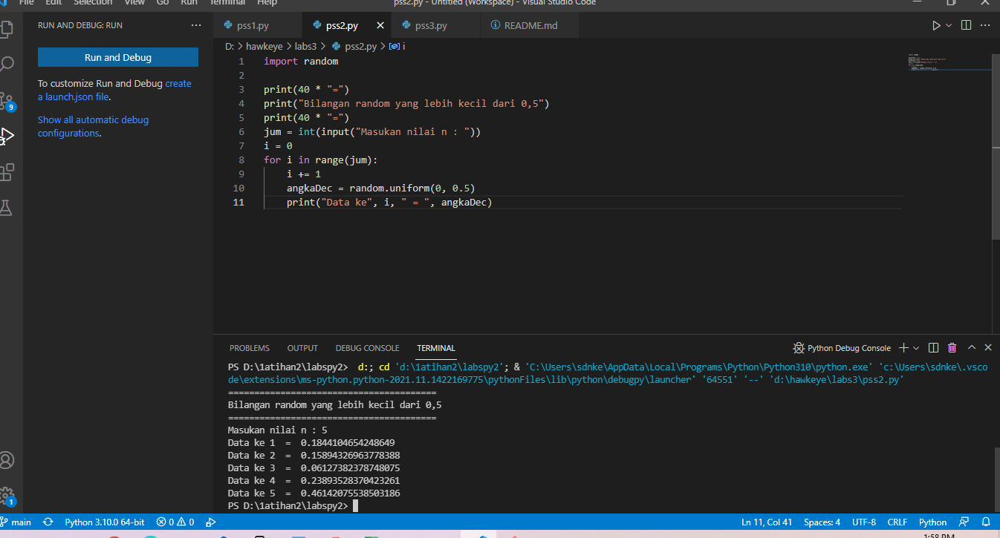
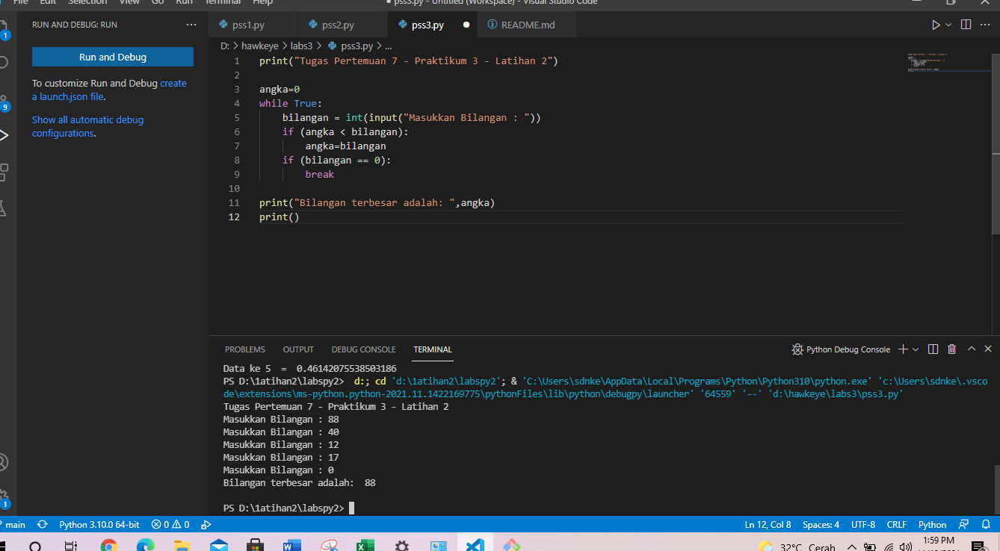

# labs3
## praktikum 3
### program
     nama   : Ariza Malik Ismail
     nim    : 312100299
     kelas  : TI.21.A.1

Tugas pertama 
kita masuk ke github membuat membuat depository sisanya liat tutorial

Kita masukk ke github membuat depositry lalu masuk ke visual code sisanya liat tutorial

Kita masukk ke github membuat depositry lalu masuk ke visual code sisanya liat tutorial

